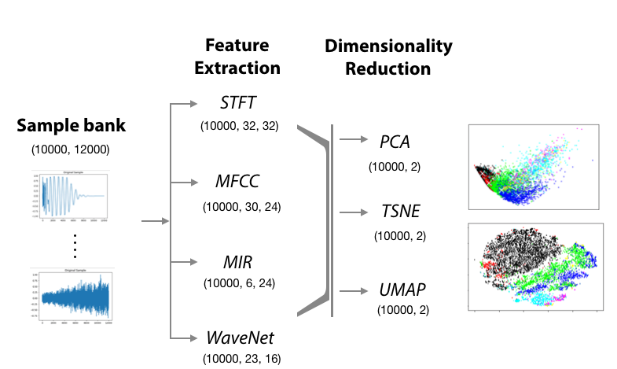
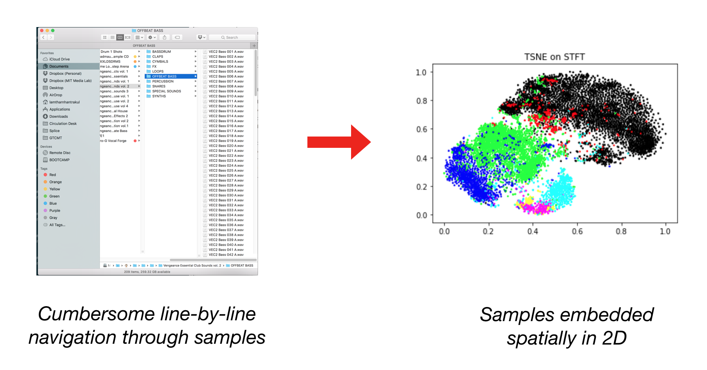

# *klustr* by Lamtharn (Hanoi) Hantrakul & Avneesh Sarwate
A tool for dimensionality reduction and visualization of large audio datasets

## *klustr* introduction
From speech, images and sensor input, data from the natural world is often high dimensional. Instead of interacting directly with this high dimensional data how-ever, a collection of audio sample is often instead organized using simple high-level descriptors, such as the type of sound e.g “vocal_shout”. However, these labels are often not available, and when available, do not capture the nuances of relationships between sounds.

In order to build relationships between samples at the timbre level, we must form representations drawn from the high dimensional audio data. These are typically in the form of STFT or MFCC features, but even these are in dimensions in the order of several thousands. This paper presents an approach of allowing users to navigate these relatively high dimensional features in 2D space.

The 2D embedding of feature is intended to substitute the normal process of "scrolling through line by line" through a large collection of audio samples by grouping timbrally similar (or "similar sounding") samples together.

## Usage Instructions

### Using Docker (recommended)

We recommend using our docker container to interact with our notebook. Our docker container contains all the of required features and pre-computed embeddings in `.npy` format. Before running our docker container, ensure that no other ports are occupied from other Jupyter Notebook sessions. Install docker and run the command

`docker run -p 8888:8888 --rm -it hanoi7/klustr jupyter notebook --NotebookApp.iopub_data_rate_limit=10000000 --ip='*' --no-browser --allow-root`

Copy paste the URL that appears in the command line into a browser and open to `1.)Main klustr Notebook`. This should be the only notebook you need to understand and reproduce our code.

* The argument `-p 8888:8888` maps the internal 8888 port in docker to the external 8888 port accessed by a host browser.
* The argument `--rm` removes the docker container after it is finished
* The argument `-it` makes the docker container interactive
* The argument `hanoi7/klustr` refers to the specific Docker container I've created located on DockerHub
* The argument `--NotebookApp.iopub_data_rate_limit=10000000` ensures that the millions of data points for each embedding do not overload the Jupyter Notebook client
* The argument `--ip='*' --no-browser --allow-root` ensures that the notebook doesn't try to call a browser inside the docker container

### Cloud hosted (use docker as outlined above...please!)

We have zipped up out notebooks and `.npy` files as a single zip folder. Download this through the link:

https://www.mediafire.com/file/3w8h4ywgnid3nyu/klustr.zip

Assuming you have conda installed, create a new conda environment. Ensure you have navigated into the root directory of `./klustr` then run command.

`pip install -f requirements.txt`

### Git Clone

You can clone the repository and still see the all the plots and analysis behind klustr, however, the git repo does not contain any of `.npy` files containing the features and dimensionality reduction embeddings.
